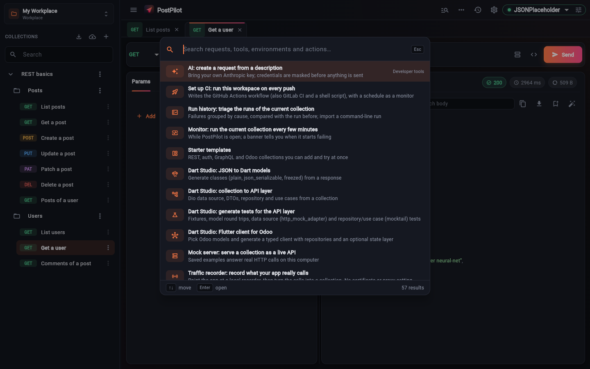
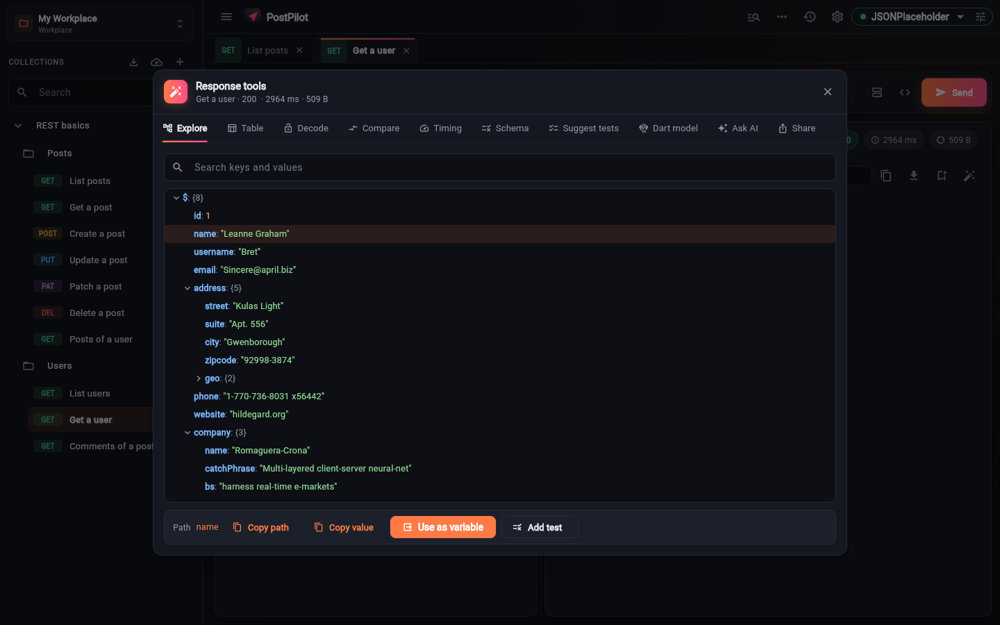
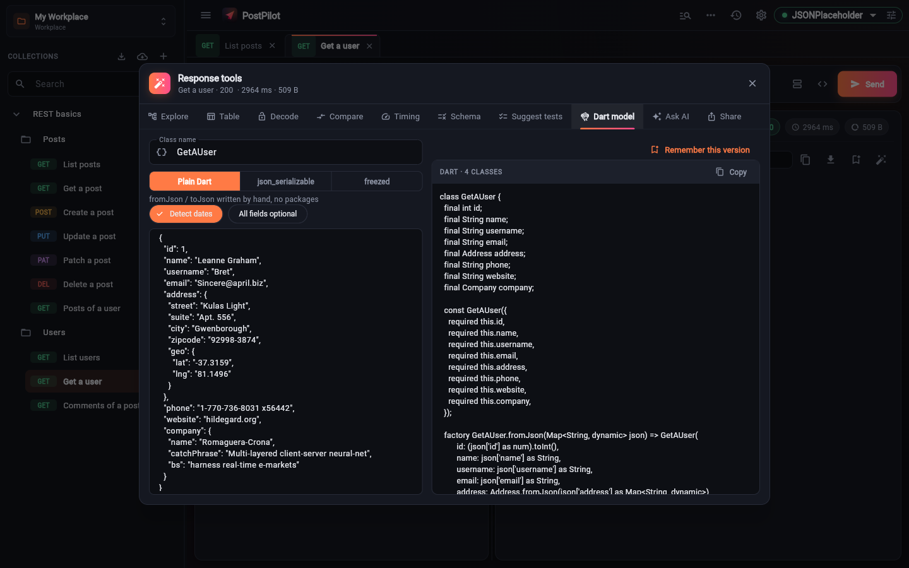
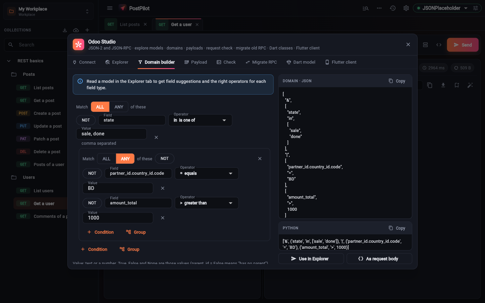
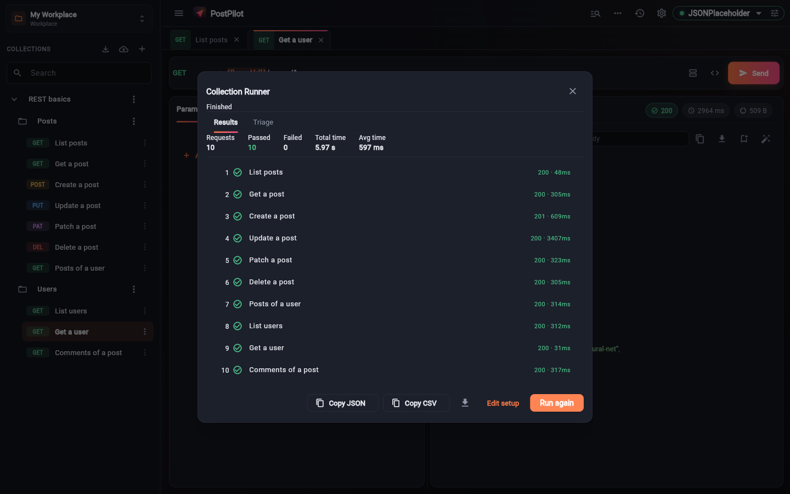
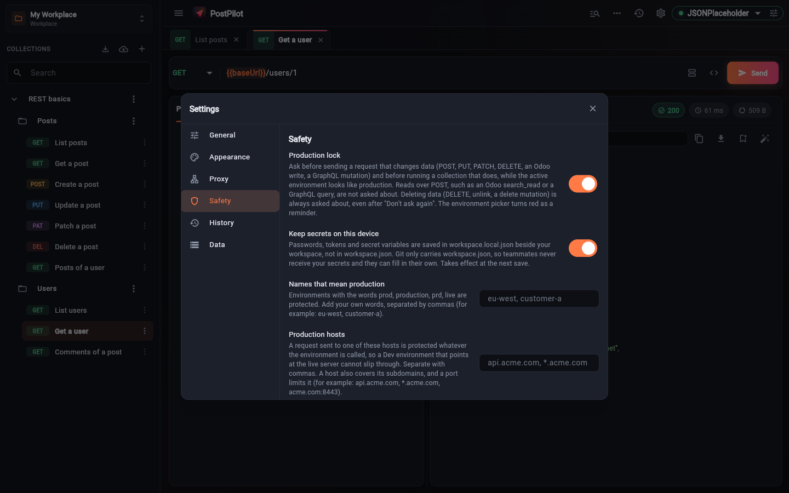
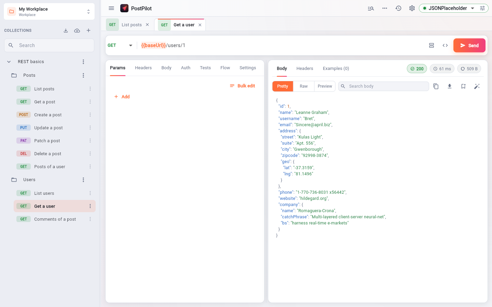
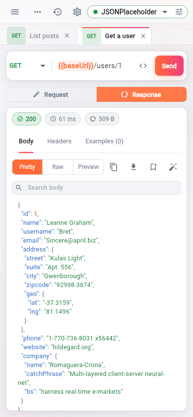

<div align="center">


<br>


[](https://github.com/ManzurulIslamBista/postpilot/actions/workflows/build-and-release.yml)

**Local-first. No account. No hosted backend.** Your data stays on your device and in the repositories you choose.

[Why PostPilot](#-what-makes-postpilot-different) • [Features](#-features) • [Download](#-download-latest-release) • [Build from source](#-build-from-source) • [Contributing](#-contributing)



</div>

## 🔥 What makes PostPilot different

PostPilot covers what you expect from an API client (requests, collections, environments, tests, import/export). On top of that it is built around three workflows that general-purpose clients do not target:

| | Only in PostPilot | What you get |
| :-: | :-- | :-- |
| 🧩 | **Odoo Studio** | Connect to an Odoo 19+ server (External JSON-2 API), explore models and fields, build domains visually, build `create`/`write` payloads, **check a request body against the live schema**, migrate old XML-RPC / JSON-RPC calls to JSON-2. |
| 🎯 | **Made for Flutter / Dart** | JSON → Dart models (plain, `json_serializable`, `freezed`), a whole **API layer** (Dio data source, DTOs, repository, use cases) and its tests generated from a collection, a **typed Flutter client for Odoo** (Provider, Riverpod or BLoC), environment export to `.env` / `--dart-define` / `AppConfig`, and a device helper (`10.0.2.2`, LAN address, QR code, `adb reverse`). |
| 🔀 | **Git is the sync layer** | A workspace is one `workspace.json` in your own GitHub repository: branches, commit, pull, push and 3-way merge inside the app. Every push shows what changed with a commit message written for you, and warns instead of overwriting a teammate. |
| 🔐 | **Secrets never reach Git** | Secret values live in `workspace.local.json` on your device. Git only carries `workspace.json`, so teammates fill in their own. |
| 🛡️ | **Production lock** | An environment named `prod` / `live` (or a production host) turns red and asks before `POST`/`PUT`/`PATCH`/`DELETE`, Odoo writes (`create`, `write`, `unlink`) and GraphQL mutations. Reads over `POST` (Odoo `search_read`, GraphQL `query`) still run. |
| 🤖 | **CLI + MCP server for AI agents** | Run a workspace headless with JUnit / JSON / Markdown reports, or expose it to AI agents over MCP. Output is secret-masked, and an agent can neither lift the production lock nor redirect a request to another host. [Details](docs/cli.md) |
| 🚦 | **CI and run triage** | Generate the GitHub Actions / GitLab CI / shell workflow in one click. Failed runs are **grouped by cause and compared with the run before**, so you see what changed. |
| 🎙️ | **Traffic recorder** | Point your app at a local recorder and turn what it really calls into a collection. No certificate or proxy setting. |


<details>
<summary><b>🖼️ Screenshot gallery</b> (static)</summary>

<table>
  <tr>
    <td width="50%"><br><sub><b>Command palette</b> (<code>Alt+Shift+P</code>): every tool, request and environment in one search.</sub></td>
    <td width="50%"><br><sub><b>Response tools:</b> JSON tree with one-click "use as variable" and "add test", table, JWT decode, compare, schema, Dart model.</sub></td>
  </tr>
  <tr>
    <td><br><sub><b>Dart models</b> from any response: plain, <code>json_serializable</code> or <code>freezed</code>.</sub></td>
    <td><br><sub><b>Odoo Studio:</b> visual domain builder with JSON and Python output.</sub></td>
  </tr>
  <tr>
    <td><br><sub><b>Collection runner</b> with data files, iterations and a Triage tab.</sub></td>
    <td><br><sub><b>Safety:</b> production lock and device-only secrets.</sub></td>
  </tr>
  <tr>
    <td><br><sub>Light and dark themes (or follow the system).</sub></td>
    <td align="center"><br><sub>The same app on a phone.</sub></td>
  </tr>
</table>

</details>


## ✨ Features

**Requests**
- `GET` `POST` `PUT` `PATCH` `DELETE` `HEAD` `OPTIONS`; bodies: JSON / text / XML / HTML, form-data (with file upload), `x-www-form-urlencoded`, GraphQL and binary.
- Auth: Bearer, Basic, API Key, Digest, AWS Signature v4, JWT Bearer and OAuth 2.0 (Client Credentials, Password, Authorization Code with PKCE). Tokens are fetched and refreshed by themselves, and a `401` can re-run a login request.
- `{{variables}}` everywhere with live preview; global, environment and collection scopes; inherited headers, auth and tests per collection or folder.
- Code snippets for 17 targets (cURL, Python, JavaScript, Node, Go, Rust, Swift, Kotlin, Java, C#, PHP, Ruby, Dart, PowerShell and more), cookie jar, console and history with search, replay and HAR export.

**Testing and automation**
- Assertions and value extractors per request, JSON Schema checks, and flow controls: poll until, retry, run if, always run, and fetch all pages.
- Collection runner with iterations, CSV / JSON data files, reordering and subsets. Test suggestions from a response.
- Mock server (saved examples answer real HTTP calls), WebSocket and Server-Sent Events, GraphQL explorer with schema browsing.

**Import, export and sharing**
- Import Postman (collections and environments, `pm.*` scripts translated), OpenAPI / Swagger, Insomnia, HAR and cURL. Export Postman, OpenAPI, cURL scripts and full backups.
- Update a collection from a newer OpenAPI spec without touching your edits. Generate API docs from a collection.
- Starter templates (REST, auth and status codes, GraphQL, Odoo) and a six-step quick tour.

**Platforms**
- Windows, macOS, Linux, Android and the web, from one Flutter codebase. Resizable panels on desktop, a stacked layout on phones.


## 📥 Download Latest Release

<p align="center">
  <a href="https://github.com/ManzurulIslamBista/postpilot/releases/latest"></a>
</p>

<p align="center">
  <a href="https://github.com/ManzurulIslamBista/postpilot/releases/latest"></a>
  <a href="https://github.com/ManzurulIslamBista/postpilot/releases"></a>
</p>

Choose the optimized package for your operating system and hardware architecture:

| Platform | Target Architecture | Package Format | Direct Download Link |
| :--- | :--- | :--- | :--- |
| 🪟 **Windows** | x86_64 / x64 | Setup Installer (`.exe`) | [**Download PostPilot_Windows_Installer.exe**](https://github.com/ManzurulIslamBista/postpilot/releases/latest/download/PostPilot_Windows_Installer.exe) |
| 🪟 **Windows** | x86_64 / x64 | Portable Archive (`.zip`) | [**Download PostPilot_Windows_x64.zip**](https://github.com/ManzurulIslamBista/postpilot/releases/latest/download/PostPilot_Windows_x64.zip) |
| 🍏 **macOS** | Universal (Intel & Silicon) | Disk Image (`.dmg`) | [**Download PostPilot_macOS_Universal.dmg**](https://github.com/ManzurulIslamBista/postpilot/releases/latest/download/PostPilot_macOS_Universal.dmg) |
| 🍏 **macOS** | Apple Silicon (M1/M2/M3/M4) | Disk Image (`.dmg`) | [**Download PostPilot_macOS_Silicon.dmg**](https://github.com/ManzurulIslamBista/postpilot/releases/latest/download/PostPilot_macOS_Silicon.dmg) |
| 🍏 **macOS** | Intel x86_64 | Disk Image (`.dmg`) | [**Download PostPilot_macOS_Intel_x86_64.dmg**](https://github.com/ManzurulIslamBista/postpilot/releases/latest/download/PostPilot_macOS_Intel_x86_64.dmg) |
| 🍏 **macOS** | All Macs | Application Archive (`.zip`) | [**Download PostPilot_macOS.zip**](https://github.com/ManzurulIslamBista/postpilot/releases/latest/download/PostPilot_macOS.zip) |
| 🤖 **Android** | Universal (All phones) | Package (`.apk`) | [**Download PostPilot_Android_Universal.apk**](https://github.com/ManzurulIslamBista/postpilot/releases/latest/download/PostPilot_Android_Universal.apk) |
| 🤖 **Android** | Modern Phones (ARM64-v8a) | Package (`.apk`) | [**Download PostPilot_Android_arm64.apk**](https://github.com/ManzurulIslamBista/postpilot/releases/latest/download/PostPilot_Android_arm64.apk) |
| 🤖 **Android** | Older Phones (ARMeabi-v7a) | Package (`.apk`) | [**Download PostPilot_Android_armv7.apk**](https://github.com/ManzurulIslamBista/postpilot/releases/latest/download/PostPilot_Android_armv7.apk) |
| 🤖 **Android** | Emulators & PC (x86_64) | Package (`.apk`) | [**Download PostPilot_Android_Intel_x86_64.apk**](https://github.com/ManzurulIslamBista/postpilot/releases/latest/download/PostPilot_Android_Intel_x86_64.apk) |
| 🐧 **Linux** | x86_64 / amd64 | Debian Package (`.deb`) | [**Download PostPilot_Linux_amd64.deb**](https://github.com/ManzurulIslamBista/postpilot/releases/latest/download/PostPilot_Linux_amd64.deb) |
| 🐧 **Linux** | x86_64 / amd64 | Portable Archive (`.tar.gz`) | [**Download PostPilot_Linux_x64.tar.gz**](https://github.com/ManzurulIslamBista/postpilot/releases/latest/download/PostPilot_Linux_x64.tar.gz) |


## 🛠️ Build from source

Needs the [Flutter SDK](https://docs.flutter.dev/get-started/install) (Dart `^3.12.0`) and, for Windows desktop, Visual Studio with "Desktop development with C++".

```bash
git clone https://github.com/ManzurulIslamBista/postpilot.git
cd postpilot
flutter pub get
dart run build_runner build --delete-conflicting-outputs   # database and model code
flutter run -d windows        # or macos, linux, chrome
```

Run the checks with `flutter analyze` and `flutter test`.

**Command line and agents** (plain Dart, no UI):

```bash
dart run bin/postpilot.dart run workspace.json --env Staging --report junit --out report.xml
dart run bin/postpilot.dart mcp workspace.json --env Staging     # MCP server over stdio
```

All options, exit codes, the production lock and agent safety are in [docs/cli.md](docs/cli.md).


## 🏗️ Under the hood

Clean Architecture with feature modules under `lib/features/`. [Flutter](https://flutter.dev), [Drift](https://drift.simonbinder.eu/) (SQLite), [Dio](https://pub.dev/packages/dio), [GetIt](https://pub.dev/packages/get_it) and [flutter_secure_storage](https://pub.dev/packages/flutter_secure_storage). Everything is stored in SQLite on your device (browser storage on the web). To share work, link a workplace or a single collection to a GitHub repository with a personal access token (`repo` scope).

## 🤝 Contributing

Issues and pull requests are welcome on the [issues page](https://github.com/ManzurulIslamBista/postpilot/issues). Fork, create a feature branch, open a pull request.

## 📄 License

[MIT](LICENSE) © 2026 **[Bista Solutions Inc.](https://www.bistasolutions.com/)**, who develop and maintain PostPilot.
