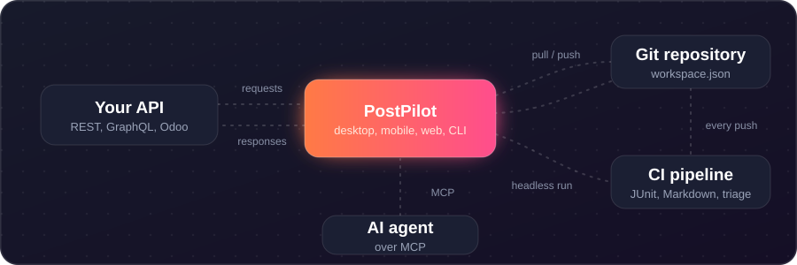

<div align="center">


<br>


[](https://github.com/ManzurulIslamBista/postpilot/actions/workflows/build-and-release.yml)
[](https://manzurulislambista.github.io/postpilot/)

**Local-first. No account. No hosted backend.** Your data stays on your device and in the repositories you choose.

> **Browser version:** it runs entirely in your tab and stores data in your browser. Requests leave the browser directly, so the API must allow CORS. For anything else (local servers, proxy, cookie jar, folder workspaces) use the desktop app.

[How it fits](#-how-it-fits-together) • [What makes it different](#-what-makes-postpilot-different) • [Features](#-everything-else) • [Try in browser](https://manzurulislambista.github.io/postpilot/) • [Download](#-download-latest-release) • [Build from source](#-build-from-source)


<br><br>


</div>


## 🧭 How it fits together

<p align="center"></p>

PostPilot talks to your API (REST, GraphQL or Odoo), keeps the workspace in your own Git repository, runs the same collections in CI, and lets an AI agent drive them over MCP.


## 🔥 What makes PostPilot different

PostPilot has the request builder, collections, environments and tests you expect from an API client. These are the parts built around Odoo, Flutter and Git, each shown below on the real app.

<table>
<tr>
<td width="37%" valign="top">

### 🧩 Odoo Studio
**Odoo is built in, not bolted on.**

- Connect to an **Odoo 19+** server (External JSON-2 API) and save it as an environment.
- Model and field **explorer**, ready-made requests, and a **visual domain builder** with JSON and Python output.
- **Payload builder** for `create` / `write` (many2one search, x2many commands) and a **request checker** against the live schema.
- **Migrate** old XML-RPC / JSON-RPC calls to JSON-2 in one paste.

</td>
<td width="63%" valign="middle">



</td>
</tr>
</table>

<table>
<tr>
<td width="63%" valign="middle">



</td>
<td width="37%" valign="top">

### 🎯 Flutter and Dart toolkit
**From a response to a typed client.**

- **JSON to Dart models**: plain, `json_serializable` or `freezed`; several samples are merged to detect optional fields.
- **Collection to API layer**: Dio data source, DTOs, repository, use cases and their tests, with an optional Provider, Riverpod or BLoC layer.
- **Typed Flutter client for Odoo** from `fields_get`.
- **Environments to Flutter**: `.env`, `env.json`, a typed `AppConfig`, launch configs and run commands. A device helper covers `10.0.2.2`, LAN address, QR code and `adb reverse`.

</td>
</tr>
</table>

<table>
<tr>
<td width="37%" valign="top">

### 🔀 Git is the sync layer
**No server of ours between you and your team.**

- A workspace is **one `workspace.json`** in your own GitHub repository. Each collection can also have its own repository, branch and folder.
- Branches, commit, **pull, push and 3-way merge** inside the app.
- Every push shows **what changed** with a commit message written for you, and warns instead of overwriting a teammate.
- Update a collection from a **newer OpenAPI spec** without touching your edits.

</td>
<td width="63%" valign="middle">



</td>
</tr>
</table>

<table>
<tr>
<td width="63%" valign="middle">



</td>
<td width="37%" valign="top">

### 🛡️ Safety first
**Production data is protected by default.**

- **Production lock**: an environment named `prod` / `live` (or a production host) turns red and asks before `POST`, `PUT`, `PATCH`, `DELETE`, Odoo writes and GraphQL mutations. Reads over `POST` still run.
- **Secrets stay on your device** in `workspace.local.json`; Git only carries `workspace.json`, so teammates fill in their own.
- The same lock guards the command line and the MCP server, and an agent cannot lift it.

</td>
</tr>
</table>

<table>
<tr>
<td valign="top">

### 🤖 Command line and AI agents
**The same collections, headless.**

- Run a workspace in **CI** with JUnit, JSON or Markdown reports, data files and iterations; exit codes say what happened.
- Expose it to AI agents over **MCP**. Output is secret-masked and an agent can neither redirect a request to another host nor lift the production lock.
- Use the **web version** with APIs that send no CORS headers: `dart run bin/postpilot.dart proxy` starts a small local CORS proxy (`--port`, `--allow-origin`, `--token`, `--allow-lan`, `--insecure`; `--help` lists them). It listens on this computer only, prints a random token that the web app must send, and logs `METHOD host/path status time` without headers or bodies. In the web app: Settings > CORS proxy. The desktop app can start the same proxy from the command palette.
- On the **hosted web app** nobody can be asked to run a program, and a public proxy would be open to abuse, so deploy your own free Cloudflare Worker (same protocol, one file, no dependencies, logs nothing). **Deploy your own CORS proxy (2 minutes):** make a free Cloudflare account, install Node.js, press *Generate a token* in Settings > CORS proxy, then run:

  ```
  npm install -g wrangler
  wrangler login
  mkdir postpilot-cors-proxy
  cd postpilot-cors-proxy
  curl -L -o cors_proxy_worker.js https://raw.githubusercontent.com/ManzurulIslamBista/postpilot/HEAD/tool/cors_proxy_worker.js
  wrangler deploy cors_proxy_worker.js --name postpilot-cors-proxy --compatibility-date 2025-01-01
  wrangler secret put POSTPILOT_TOKEN --name postpilot-cors-proxy
  ```

  Paste the `https://postpilot-cors-proxy.<your-name>.workers.dev` address and the token into Settings > CORS proxy and press *Test connection*. Only your token opens it; `ALLOWED_ORIGINS` (a Worker variable, add `--var ALLOWED_ORIGINS:https://your-host` when you host PostPilot yourself) names the pages that may use it, by default the hosted app and localhost.
- Details, flags and exit codes: [docs/cli.md](docs/cli.md)

</td>
</tr>
<tr>
<td align="center">



</td>
</tr>
</table>

<table>
<tr>
<td width="37%" valign="top">

### 🚦 CI and run triage
**Know why it broke, not just that it broke.**

- **Set up CI** writes the GitHub Actions workflow (also GitLab CI and a shell script), with an optional schedule.
- Failed runs are **grouped by cause** with a hint each, compared with the run before, with **re-run failed only** and **copy as GitHub issue**.
- **Monitor** a collection every few minutes while the app is open.

</td>
<td width="63%" valign="middle">



</td>
</tr>
</table>

<table>
<tr>
<td width="63%" valign="middle">



</td>
<td width="37%" valign="top">

### ⚡ The everyday client
**Fast where you spend most of your time.**

- **Response tools**: JSON tree with one-click "use as variable" and "add test", table, JWT decode, compare, schema check.
- **Command palette** (`Alt+Shift+P`) finds every tool, request and environment.
- **Collection runner** with iterations, CSV / JSON data files and a triage tab.
- **Import** cURL, Postman, OpenAPI / Swagger, Insomnia and HAR: the format is detected for you.

</td>
</tr>
</table>


## ✨ Everything else

**Requests**
- `GET` `POST` `PUT` `PATCH` `DELETE` `HEAD` `OPTIONS`; bodies: JSON / text / XML / HTML, form-data (with file upload), `x-www-form-urlencoded`, GraphQL and binary.
- Auth: Bearer, Basic, API Key, Digest, AWS Signature v4, JWT Bearer and OAuth 2.0 (Client Credentials, Password, Authorization Code with PKCE). Tokens are fetched and refreshed by themselves, and a `401` can re-run a login request.
- `{{variables}}` everywhere with live preview; global, environment and collection scopes; headers, auth and tests inherited per collection or folder.
- Code snippets for 17 targets (cURL, Python, JavaScript, Node, Go, Rust, Swift, Kotlin, Java, C#, PHP, Ruby, Dart, PowerShell and more), cookie jar, console, and history with search, replay and HAR export.

**Testing and tools**
- Assertions and value extractors per request, JSON Schema checks, flow controls (poll until, retry, run if, always run) and fetch all pages. Test suggestions from a response.
- Mock server (saved examples answer real HTTP calls), WebSocket and Server-Sent Events, GraphQL explorer, and a traffic recorder that turns what your app really calls into a collection (desktop app).

**Import, export and docs**
- Export Postman, OpenAPI, cURL scripts and full backups; Postman `pm.*` scripts are translated on import. Generate API docs from a collection.
- Starter templates (REST, auth and status codes, GraphQL, Odoo) and a six-step quick tour.

**Platforms**
- Windows, macOS, Linux, Android and the web from one Flutter codebase: resizable panels on desktop, a stacked layout on phones, light and dark themes.

**Web version**
- Everything that only needs a browser works: requests (to APIs that allow web pages, see CORS above), environments, history, response tools, Dart Studio, Odoo Studio, Git sync through the GitHub API, import and export. The data lives in the browser's storage (a database plus a workspace file of up to about 4 MB: the sidebar warns when it gets close and links to Backup and restore).
- Where a desktop app writes a folder, the browser downloads: Dart Studio, Odoo Studio and the environment export give one file or a `.zip` that keeps the folder layout, and *Set up CI* downloads the workflow.
- These need the desktop app, and the command palette lists them greyed out with the reason: the mock server and the traffic recorder (a browser cannot open server sockets), finding emulators and phones, a proxy, certificate and redirect settings, the persistent cookie jar and Server-Sent Events. Files chosen for an upload stay in the page only until it is reloaded.
- A browser keeps Ctrl+N, Ctrl+W and Ctrl+T for itself, so the web version uses Alt for the shortcuts that would clash (the command palette is Alt+Shift+P).

<table>
<tr>
<td width="68%"></td>
<td width="32%" align="center"></td>
</tr>
</table>


## 📥 Download Latest Release

<p align="center">
  <a href="https://github.com/ManzurulIslamBista/postpilot/releases/latest"></a>
</p>

<p align="center">
  <a href="https://github.com/ManzurulIslamBista/postpilot/releases/latest"></a>
  <a href="https://github.com/ManzurulIslamBista/postpilot/releases"></a>
</p>

Choose the optimized package for your operating system and hardware architecture:

| Platform | Target Architecture | Package Format | Direct Download Link |
| :--- | :--- | :--- | :--- |
| 🪟 **Windows** | x86_64 / x64 | Setup Installer (`.exe`) | [**Download PostPilot_Windows_Installer.exe**](https://github.com/ManzurulIslamBista/postpilot/releases/latest/download/PostPilot_Windows_Installer.exe) |
| 🪟 **Windows** | x86_64 / x64 | Portable Archive (`.zip`) | [**Download PostPilot_Windows_x64.zip**](https://github.com/ManzurulIslamBista/postpilot/releases/latest/download/PostPilot_Windows_x64.zip) |
| 🍏 **macOS** | Universal (Intel & Silicon) | Disk Image (`.dmg`) | [**Download PostPilot_macOS_Universal.dmg**](https://github.com/ManzurulIslamBista/postpilot/releases/latest/download/PostPilot_macOS_Universal.dmg) |
| 🍏 **macOS** | Apple Silicon (M1/M2/M3/M4) | Disk Image (`.dmg`) | [**Download PostPilot_macOS_Silicon.dmg**](https://github.com/ManzurulIslamBista/postpilot/releases/latest/download/PostPilot_macOS_Silicon.dmg) |
| 🍏 **macOS** | Intel x86_64 | Disk Image (`.dmg`) | [**Download PostPilot_macOS_Intel_x86_64.dmg**](https://github.com/ManzurulIslamBista/postpilot/releases/latest/download/PostPilot_macOS_Intel_x86_64.dmg) |
| 🍏 **macOS** | All Macs | Application Archive (`.zip`) | [**Download PostPilot_macOS.zip**](https://github.com/ManzurulIslamBista/postpilot/releases/latest/download/PostPilot_macOS.zip) |
| 🤖 **Android** | Universal (All phones) | Package (`.apk`) | [**Download PostPilot_Android_Universal.apk**](https://github.com/ManzurulIslamBista/postpilot/releases/latest/download/PostPilot_Android_Universal.apk) |
| 🤖 **Android** | Modern Phones (ARM64-v8a) | Package (`.apk`) | [**Download PostPilot_Android_arm64.apk**](https://github.com/ManzurulIslamBista/postpilot/releases/latest/download/PostPilot_Android_arm64.apk) |
| 🤖 **Android** | Older Phones (ARMeabi-v7a) | Package (`.apk`) | [**Download PostPilot_Android_armv7.apk**](https://github.com/ManzurulIslamBista/postpilot/releases/latest/download/PostPilot_Android_armv7.apk) |
| 🤖 **Android** | Emulators & PC (x86_64) | Package (`.apk`) | [**Download PostPilot_Android_Intel_x86_64.apk**](https://github.com/ManzurulIslamBista/postpilot/releases/latest/download/PostPilot_Android_Intel_x86_64.apk) |
| 🐧 **Linux** | x86_64 / amd64 | Debian Package (`.deb`) | [**Download PostPilot_Linux_amd64.deb**](https://github.com/ManzurulIslamBista/postpilot/releases/latest/download/PostPilot_Linux_amd64.deb) |
| 🐧 **Linux** | x86_64 / amd64 | Portable Archive (`.tar.gz`) | [**Download PostPilot_Linux_x64.tar.gz**](https://github.com/ManzurulIslamBista/postpilot/releases/latest/download/PostPilot_Linux_x64.tar.gz) |


## 🛠️ Build from source

Needs the [Flutter SDK](https://docs.flutter.dev/get-started/install) (Dart `^3.12.0`) and, for Windows desktop, Visual Studio with "Desktop development with C++".

```bash
git clone https://github.com/ManzurulIslamBista/postpilot.git
cd postpilot
flutter pub get
dart run build_runner build --delete-conflicting-outputs   # database and model code
flutter run -d windows        # or macos, linux, chrome
```

Run the checks with `flutter analyze` and `flutter test`.

**Command line and agents** (plain Dart, no UI):

```bash
dart run bin/postpilot.dart run workspace.json --env Staging --report junit --out report.xml
dart run bin/postpilot.dart mcp workspace.json --env Staging     # MCP server over stdio
```

All options, exit codes, the production lock and agent safety are in [docs/cli.md](docs/cli.md).


## 🏗️ Under the hood

Clean Architecture with feature modules under `lib/features/`. [Flutter](https://flutter.dev), [Drift](https://drift.simonbinder.eu/) (SQLite), [Dio](https://pub.dev/packages/dio), [GetIt](https://pub.dev/packages/get_it) and [flutter_secure_storage](https://pub.dev/packages/flutter_secure_storage). Everything is stored in SQLite on your device (browser storage on the web). To share work, link a workplace or a single collection to a GitHub repository with a personal access token (`repo` scope).

## 🤝 Contributing

Issues and pull requests are welcome on the [issues page](https://github.com/ManzurulIslamBista/postpilot/issues). Fork, create a feature branch, open a pull request.

## 📄 License

[MIT](LICENSE) © 2026 **[Bista Solutions Inc.](https://www.bistasolutions.com/)**, who develop and maintain PostPilot.
